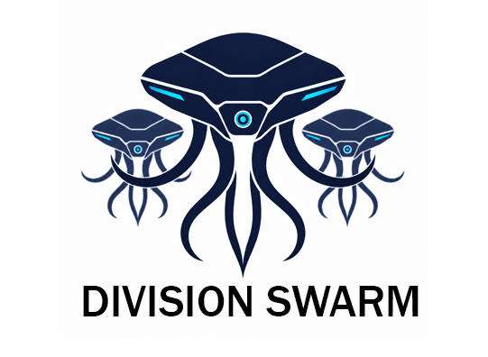
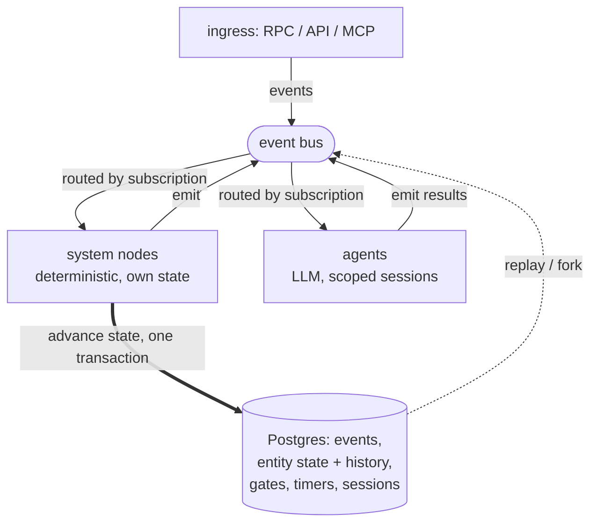

<p align="center"></p>

# Division Swarm

**The operating system for autonomous multi-agent systems.**

Swarm runs fleets of LLM agents as a durable, stateful system. You declare it in YAML and a deterministic engine runs it, owning state, routing, isolation, cost, and recovery. The LLM never runs the system: agents reason in scoped sessions and emit events, and deterministic code, never the model, decides what each result changes.

More than a simple orchestrator that decides which agent runs next, Swarm runs the system around it. Work is modeled as entities (an order, a ticket, a candidate business) moving through a state machine you declare: the runtime schedules hundreds at once, keeps them isolated, meters their spend, persists their state, and resumes them after a crash, days later if a timer or a human kept them waiting. Any run can be replayed or forked from the log. Deterministic routing is one piece; the rest is the operating system.

Single Go binary, Postgres for persistence. Three LLM backend profiles ship today: `anthropic` for Anthropic API, `claude_cli` for the Claude CLI subprocess transport, and `openai_compatible` for Chat Completions-compatible HTTP JSON. All three consume the shared LLM provider adapter contract; native OpenAI Responses and provider-specific OpenRouter, Ollama, Bedrock, Azure OpenAI, Vertex, or vLLM support remain separate gated runtime/config work.

**Long-term direction:** entire divisions (engineering, support, operations) running as autonomous Swarm flows. Humans in the loop where judgment is required; agents and deterministic system nodes everywhere else.

---

## Design positions

Swarm makes a small number of opinionated choices and sticks to them.

- **Work is a durable state machine.** Every unit of work is an entity that moves through declared states by guarded transitions. The runtime tracks where each one is in Postgres, so state survives a crash and hundreds of entities advance independently without interfering.
- **The control loop is deterministic.** No LLM decides what fires next. Routing is derived from declared subscriptions, and every event runs through a fixed handler pipeline. Conditions use [CEL](https://github.com/google/cel-spec): strongly typed, non-Turing-complete, no hallucinating router.
- **Every transition is one transaction.** Guard, accumulate, compute, commit, emit: all-or-nothing. A crash mid-handler leaves no partial state.
- **Flows are composable units.** A flow package declares its identity, state machine, system nodes, events, agents, tools, and policy. Typed input and output pins make composition mechanical rather than a refactor. Create your specialized flows and import them in other Swarm projects.
- **Agents are isolated.** Each agent runs in a scoped session and observes only the events it subscribes to. A coordinator addresses managers; managers address workers; workers do not share a context window. Per-entity Docker workspaces extend the isolation to the filesystem and process level: agents working on entity X have no access to entity Y's working tree.
- **Execution is replayable.** Every event and every state mutation is persisted. Any run can be reconstructed turn by turn, audited end to end, or resumed from its last consistent checkpoint after a crash. Auditability is native. 
- **Runs are forkable.** Re-execute any run from any point in its history with a counterfactual like a different policy value, a tweaked prompt, or an entirely new contract bundle, and compare outcomes against the original. Last week's failed run can be replayed against this week's fixed contracts. The cost of iterating on a flow drops to the cost of forking a run, which turns continuous improvement into a regular engineering loop instead of a deploy-and-watch cycle.
- **Humans participate as a first-class actor.** Approvals, rejections, and deferrals flow through a durable mailbox using the same event model as the rest of the runtime. A pending decision is just another event waiting for its handler: a human's, in this case. Autonomy is a dial, not a switch.

The tradeoff: a Swarm flow cannot be re-wired by an LLM at runtime. That rigidity is the point.

---

## Try it

```bash
# run the static analyzer: 54 contract checks against the platform spec
swarm verify --contracts ./my-flow

# start a run from a triggering event, stream its trace as it executes
swarm run --contracts ./my-flow --event order.created --payload ./payload.json

# follow the full causal trace of any run, live or historical
swarm trace <run-id> -f

# re-execute any run from any point in its history
swarm fork --run <id> --at <event>
```

---

## A flow is a contract

A handler is declared in YAML. The engine reads it and executes it. No product-specific code hooks.

```yaml
# nodes.yaml
ticket-orchestrator:
  event_handlers:
    ticket.validated:
      guard:
        check: "entity.priority in ['high', 'urgent']"
        on_fail: discard
      data_accumulation:
        writes: [order_summary, validation_context]
      sets_gate: g1_validation
      advances_to: processing
      emit: work.assigned
```

Execution order is fixed by the dependency graph:

```
guard ──▶ accumulate ──▶ compute ──▶ {advances_to, sets_gate, data_accumulation} ──▶ emit ──▶ action
                                              │
                                       atomic commit
```

Guard failures have explicit semantics: `reject` (default), `discard`, `kill`, or `escalate:{event}`. Conditions use [CEL](https://github.com/google/cel-spec): strongly typed, non-Turing-complete.

---

## Quickstart

Requires Docker, a contract bundle, and credentials for the configured shipped LLM runtime. The Compose quickstart currently starts the orchestrator with the `claude_cli` backend from `docker-compose.yml`; `.env` supplies secrets such as `CLAUDE_CODE_OAUTH_TOKEN`, not the backend selector.

```bash
# 1. clone
git clone https://github.com/<org>/swarm && cd swarm

# 2. point at a contract bundle and provide Compose credentials
export SWARM_CONTRACTS_HOST_DIR=/absolute/path/to/your/contracts
echo 'CLAUDE_CODE_OAUTH_TOKEN=...' >> .env
echo "SWARM_API_TOKEN=$(uuidgen | tr '[:upper:]' '[:lower:]')" >> .env

# 3. boot
docker compose up -d postgres orchestrator

# 4. confirm the runtime is up and contracts validated
curl -fsS http://localhost:8070/healthz

# 5. trigger a run
docker compose exec orchestrator swarm run \
  --event order.created \
  --payload-json '{"order_id":"o-123","priority":"high"}'
```

If you only need the local database, `docker compose up -d postgres` is supported
without `SWARM_CONTRACTS_HOST_DIR`. The contracts path is required only when
starting the `orchestrator` service. The Compose orchestrator also requires
`SWARM_API_TOKEN` because it binds the API inside the container on `0.0.0.0`.
Plain local `swarm serve` and foreground `swarm run` use the built-in dev API
token only on numeric loopback binds, with bearer auth still enabled. Set an
explicit token before exposing the API beyond loopback; the built-in token is
not user isolation on a shared host.

### LLM Backend Profiles

Outside the Compose quickstart, select a shipped backend with `--backend` or
the equivalent `llm.backend` config key. Selection precedence is
`--backend > llm.backend > default anthropic`; environment variables never
select the backend. Commands that need runtime/operator config discover an
explicit `--config` first, `config.yaml` beside the running binary second, and
built-in/default config last.

```bash
# Anthropic API transport.
export ANTHROPIC_API_KEY=...
swarm serve --backend anthropic --config ./config.yaml

# Claude CLI transport.
export CLAUDE_CODE_OAUTH_TOKEN=...
swarm serve --backend claude_cli --config ./config.yaml

# Chat Completions-compatible HTTP JSON transport.
export OPENAI_COMPATIBLE_API_KEY=...
swarm serve --backend openai_compatible --config ./config.yaml
```

`openai_compatible` uses `llm.openai_compatible.base_url` as the deployment
configuration for a Chat Completions-compatible HTTP JSON endpoint and
normalizes it to `/v1/chat/completions`. This profile is not native OpenAI
Responses API support, not an official-OpenAI-only provider identity, and not
provider-matrix support for OpenRouter, Ollama, Bedrock, Azure OpenAI, Vertex,
or vLLM.

Runtime config owns non-secret LLM behavior, including backend selection,
provider endpoint/base URLs, and model alias maps. Environment variables remain
for credentials and explicitly-owned infra connection values only. The selected
backend fails fast if its required credential is missing.

| Backend | Required credential env var |
|---|---|
| `anthropic` | `ANTHROPIC_API_KEY` |
| `claude_cli` | `CLAUDE_CODE_OAUTH_TOKEN` |
| `openai_compatible` | `OPENAI_COMPATIBLE_API_KEY` |

```yaml
# config.yaml
llm:
  backend: openai_compatible
  session:
    lock_ttl: 10s
    rotate_after_turns: 40
    rotate_on_parse_failures: 3
  openai_compatible:
    base_url: https://api.example.com
  models:
    regular:
      anthropic: claude-3-5-sonnet
      claude_cli: sonnet
      openai_compatible: gpt-compatible
```

Authored agents choose provider-agnostic model aliases with `model`. Built-in
aliases are `cheap`, `regular`, and `frontier`; `llm.models` can override any
alias per backend profile.

```yaml
# agents.yaml
support-agent:
  model: regular
  subscriptions: [ticket.created]
  emit_events: [ticket.triaged]
```

For an end-to-end walkthrough (building a flow from scratch), see [`docs/specs/swarm-platform/SWARM-DEVELOPER-GUIDE.md`](docs/specs/swarm-platform/SWARM-DEVELOPER-GUIDE.md).

---

## Core concepts

| Concept | One line |
|---|---|
| **Flow** | A self-contained package with input/output pins. The marketplace unit. |
| **State** | A named state in a flow's state machine. An entity is in exactly one at a time. |
| **System node** | Deterministic code. Subscribes to events, advances state, emits events. No LLM. |
| **Agent** | LLM-powered. Subscribes to events, reasons, calls tools. Can own transitions that require judgment. |
| **Handler** | The unit of execution attached to an event. Composed of guard, accumulate, advances_to, sets_gate, emit, action. |
| **Event** | A typed message with a payload schema declared in `events.yaml`. |
| **Gate** | A named boolean set by a handler. Other handlers can guard on it. |
| **Timer** | A durable time-based trigger attached to a stage. Persisted across restarts. |
| **Pin** | A typed input or output of a flow. Used at composition time to wire flows together. |

Authoritative reference: [`platform-spec.yaml`](platform-spec.yaml). The generated public API artifact is [`openrpc.json`](openrpc.json).

---

## CLI

Generated subset of `swarm --help`. Each command targets the running orchestrator's v1 RPC unless otherwise noted.

| Command | Purpose |
|---|---|
| `swarm serve` | Start the runtime, API, health, and MCP surfaces. |
| `swarm verify` | Run the static analyzer against local contract files. |
| `swarm run` | Start or reattach to a run; stream its trace. |
| `swarm trace [run-id]` | Print or follow (`-f`) the causal trace of a run. |
| `swarm runs` | List runs. |
| `swarm status [run-id]` | Diagnose one run. |
| `swarm health` | Operator health summary. |
| `swarm events {list,follow,view}` | Inspect the event log. |
| `swarm event {replay,view}` | Replay or view a single historical event. |
| `swarm publish <event>` | Publish one event into the runtime. |
| `swarm entities {list,view,aggregate}` | Inspect entity state. |
| `swarm agents` / `swarm agent {view,restart,directive,replay,replay-backlog}` | Inspect or control agents. |
| `swarm conversations` / `swarm conversation {view,turn}` | Inspect agent sessions and turns. |
| `swarm incidents` | List runtime incidents. |
| `swarm logs` | List or follow runtime logs. |
| `swarm control mailbox {list,view,approve,reject,defer}` | Human-in-the-loop mailbox decisions. |
| `swarm control nuke` | Destructively reset runtime state. |
| `swarm fork` | Re-execute a run from any point in its history. *(Shipping shortly.)* |
| `swarm version` | Print binary version. |
| `swarm completion <shell>` | Generate shell completion. |

---

## Architecture

A contract bundle is verified by the static analyzer, then loaded into the engine, which starts the event loop. From there, everything is an event. An event, whether it arrived from ingress or was emitted by a node or an agent, is validated against its schema, persisted, and routed to its subscribers by their declared subscriptions, never by an LLM. Exactly one system node owns each event: it runs a fixed handler pipeline and commits the state change, gate writes, data writes, and any emitted events in a single transaction. Agents subscribe too, but they only reason inside a scoped session and emit their results back as events; a system node decides what those results actually change. Because every event and every state mutation is persisted, any run can be replayed turn by turn or forked from the log.



Only the system node writes state, and it does so in one transaction; agents reach the store only indirectly, by emitting an event a node handles. Underneath the loop are the primitives that make the design positions enforceable:

- **A static analyzer for contracts.** Before any event fires, every contract is run through 54 structural checks: state reachability, payload completeness, agent routing, timer lifecycle, CEL parse, prompt linting. A bundle that boots has passed this analysis.
- **Two-layer event-sourced persistence.** Every event lands in Postgres; every entity state mutation lands in a separate mutation log with before/after diffs. Replay says "show me what happened"; the mutation log says "show me exactly what changed." Accumulator projections compute read-models off the streams, so handlers and external readers can query aggregated state without scanning the raw logs.
- **Role-based routing authority.** Agent isolation is enforced by an authority layer that decides, per entity status, which agent role may address which other role. "Any agent can talk to any agent" is not a default the runtime offers.
- **Reliability primitives.** Undeliverable events retry with exponential backoff and land in a dead-letter store after exhaustion. Dead-letters are indexed and replayable.
- **Live budget tracking.** Token usage is tracked per entity and per actor in real time. Declared thresholds escalate into throttle and emergency states; humans get a mailbox item when the runtime hits an emergency.
- **A comprehensive JSON-RPC API.** 43 methods across runs, events, agents, conversations, entities, mailbox, and runtime control, plus WebSocket subscriptions for live traces, event streams, log tails, and health. The surface is published as a machine-readable OpenRPC document, so clients can be generated rather than hand-coded. The `swarm` CLI is one such client; anyone can build their own.
- **MCP gateway.** Swarm both exposes and consumes the Model Context Protocol. External tools can drive a runtime over MCP; agents pull tool definitions from upstream MCP servers without code changes.

---

## When to use Swarm

Swarm is opinionated. Work is a durable state machine, routing is deterministic, and persistence, isolation, and cost control are the substrate rather than add-ons. That depth buys reproducibility, crash recovery, and audit, and it costs YAML and a static-analyzer pass before the runtime starts. The tradeoff is the right one for some workloads and the wrong one for others.

The static analyzer's refusal to boot on a half-finished contract is a feature in production and a friction in exploration. Plan accordingly.

### Strong fit

- **Long-running workflows where reproducibility matters.** Anything where someone will eventually ask "why did the system do that on October 14th at 03:47?"
- **Multi-agent coordination at three or more roles.** Coordinator, specialists, reviewer. Hierarchical addressing avoids the context-window explosion of flat setups.
- **Crash recovery is a requirement, not a nice-to-have.** Atomic transitions and event replay are baseline, not bolt-on.
- **Regulated or audited environments.** Two-layer event-plus-mutation persistence makes "what changed, when, and because of which event" a single SQL query.
- **High-volume parallel entities.** Orders, tickets, leads, claims. Per-entity workspaces let hundreds flow through the same contract without interfering.
- **Cost-controlled deployments.** Live budget tracking with throttle and emergency states is built in, not a future add-on.

### Weak fit

- **One-shot LLM calls.** Use the provider SDK directly. No runtime needed.
- **Conversational chatbots.** Short interactions where the value is in the conversation. The YAML overhead does not pay for itself.
- **Exploratory prototyping where the workflow changes every hour.** The static analyzer refusing to boot a half-finished contract is exactly the wrong friction during design. Sketch loose first; port to Swarm once the workflow stabilizes.
- **LLM-managed routing at runtime.** Swarm explicitly refuses this. If "the model decides what happens next" is the point of your system, this is the wrong tool.
- **Sunday-afternoon prototypes.** Postgres, Docker, and a separate runtime is too much infrastructure for casual use.

---

## Project status

**Pre-1.0. Breaking changes expected.**

- Platform specification: **v1.6.0**, complete. See [`platform-spec.yaml`](platform-spec.yaml).
- Engine: Go, Phase 11. Handler-first execution for the proven-safe subset; full handler-first execution in progress.
- Conformance suite: **12 tiers, 201 distinct test contract bundles** spanning primitives, accumulation, atomic event-loop semantics, composition, boot verification, runtime fork, and policy patterns. The suite runs against a scripted LLM, so it doesn't pay an LLM bill.
- The `swarm fork` CLI is shipping shortly. The engine plumbing is implemented and tested; only the user-facing command wrapper is pending.
- Used internally to power autonomous multi-agent workflows. External use at your own risk.

The trajectory points at running whole company divisions as autonomous flows. The shipped surface today covers a much smaller scope: deterministic multi-agent orchestration with human-in-the-loop, on a single deployment. Distributed execution, multi-tenant isolation, and a flow marketplace are not yet in scope.

---

## Documentation

| Document | Read this when… |
|---|---|
| [`SWARM-PLATFORM-BRIEF.md`](docs/specs/swarm-platform/SWARM-PLATFORM-BRIEF.md) | You want the 5-minute pitch and design rationale. |
| [`SWARM-DEVELOPER-GUIDE.md`](docs/specs/swarm-platform/SWARM-DEVELOPER-GUIDE.md) | You want to build a flow from scratch. |
| [`platform-spec.yaml`](platform-spec.yaml) | You need the authoritative specification. |
| [`openrpc.json`](openrpc.json) | You need the generated public API artifact. |
| [`BUILDER-API.md`](docs/specs/swarm-platform/platform/BUILDER-API.md) | You're integrating with the Builder surface. |
| [`FLIGHT-RECORDER.md`](docs/specs/swarm-platform/platform/FLIGHT-RECORDER.md) | You're debugging a run from its trace. |
| [`SECURITY.md`](SECURITY.md) | You need to report a suspected vulnerability privately. |

---

## Development

Requirements: Go 1.23, Docker, Postgres 16 (provided via `docker-compose.yml`).
Start only the database with `docker compose up -d postgres`; starting the
orchestrator additionally requires `SWARM_CONTRACTS_HOST_DIR` and an explicit
`SWARM_API_TOKEN` because the Compose API listener is non-loopback.

```bash
# build
go build ./cmd/swarm

# lint
golangci-lint run

# tests
go test ./...

# local runtime commands
go run ./cmd/swarm serve --contracts ./contracts
go run ./cmd/swarm run --connect http://127.0.0.1:8081 --event <event> --payload <payload.json>
go run ./cmd/swarm control nuke --api-server http://127.0.0.1:8081 --yes
```

See [`docs/IMPLEMENTER_GUIDELINES.md`](docs/IMPLEMENTER_GUIDELINES.md) and [`docs/COLLABORATION_WORKFLOW.md`](docs/COLLABORATION_WORKFLOW.md) before opening a PR.

---

## License

Apache License 2.0. See `LICENSE`.
