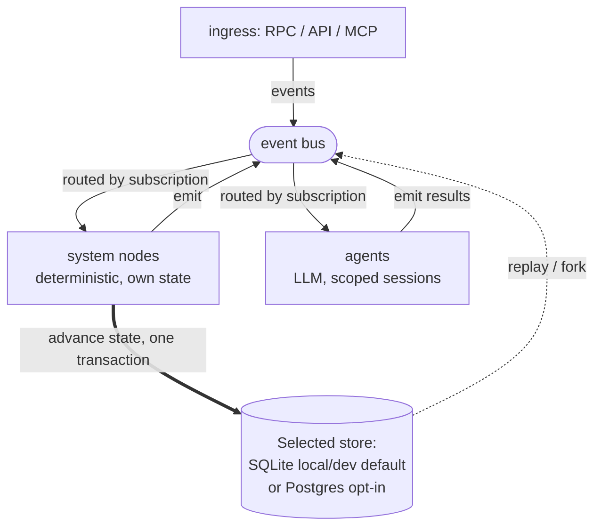

<p align="center"></p>

# Division Swarm

<p align="center">
  <a href="LICENSE"></a>
  <a href="platform-spec.yaml"></a>
  <a href="https://goreportcard.com/report/github.com/division-sh/swarm"></a>
  <a href="https://github.com/division-sh/swarm/discussions"></a>
  <a href="https://docs.division.sh"></a>
</p>

**The operating system for autonomous multi-agent systems.**

Swarm runs fleets of LLM agents as a durable, stateful system. You declare it in YAML and a deterministic engine runs it, owning state, routing, isolation, cost, and recovery. The LLM never runs the system: agents reason in scoped sessions and emit events, and deterministic code, never the model, decides what each result changes.

More than a simple orchestrator that decides which agent runs next, Swarm runs the system around it. Work is modeled as entities (an order, a ticket, a candidate business) moving through a state machine you declare: the runtime schedules hundreds at once, keeps them isolated, meters their spend, persists their state, and resumes them after a crash, days later if a timer or a human kept them waiting. Any run can be replayed or forked from the log. Deterministic routing is one piece; the rest is the operating system.

Single Go binary, local/dev SQLite by default with Postgres as a production opt-in. Multiple LLM backends ship today: the Anthropic API, the Claude CLI, OpenAI-compatible Chat Completions endpoints, and native OpenAI Responses.

**Long-term direction:** entire divisions (engineering, support, operations) running as autonomous Swarm flows. Humans in the loop where judgment is required; agents and deterministic system nodes everywhere else.

---

## Design positions

Swarm makes a small number of opinionated choices and sticks to them.

- **Work is a durable state machine.** Every unit of work is an entity that moves through declared states by guarded transitions. The runtime persists state, so state survives a crash and hundreds of entities advance independently without interfering.
- **The control loop is deterministic.** No LLM decides what fires next. Routing is derived from declared subscriptions, and every event runs through a fixed handler pipeline. Conditions use [CEL](https://github.com/google/cel-spec): strongly typed, non-Turing-complete, no hallucinating router.
- **Every transition is one transaction.** Guard, accumulate, compute, commit, emit: all-or-nothing. A crash mid-handler leaves no partial state.
- **Flows are composable units.** A flow package declares its identity, state machine, system nodes, events, agents, tools, and policy. Typed input and output pins make composition mechanical rather than a refactor. Create your specialized flows and import them in other Swarm projects.
- **Agents are isolated.** Each agent runs in a scoped session and observes only the events it subscribes to. A coordinator addresses managers; managers address workers; workers do not share a context window. Per-entity Docker workspaces extend the isolation to the filesystem and process level: agents working on entity X have no access to entity Y's working tree.
- **Execution is replayable.** Every event and every state mutation is persisted. Any run can be reconstructed turn by turn, audited end to end, or resumed from its last consistent checkpoint after a crash. Auditability is native.
- **Runs are forkable.** Re-execute any run from any point in its history with a counterfactual like a different policy value, a tweaked prompt, or an entirely new contract bundle, and compare outcomes against the original. Last week's failed run can be replayed against this week's fixed contracts. The cost of iterating on a flow drops to the cost of forking a run, which turns continuous improvement into a regular engineering loop instead of a deploy-and-watch cycle.
- **Humans participate as a first-class actor.** Approvals, rejections, and deferrals flow through a durable mailbox using the same event model as the rest of the runtime. A pending decision is just another event waiting for its handler: a human's, in this case. Autonomy is a dial, not a switch.
- **Spec-driven and well-suited for agentic authoring.** The platform specification is a single machine-readable YAML file, the static analyzer's errors cite check ids and exact field paths an LLM can act on directly, and 200+ verifying conformance bundles provide working patterns to mirror. See [For agent authors](https://docs.division.sh/build/agentic-authoring).

The tradeoff: a Swarm flow cannot be re-wired by an LLM at runtime. That rigidity is the point.

---

## Try it

```bash
# run the static analyzer against the platform spec
swarm verify --contracts ./my-flow

# start a run from a triggering event, stream its trace as it executes
swarm run --contracts ./my-flow --event order.created --payload ./payload.json

# follow the full causal trace of any run, live or historical
swarm trace <run-id> -f

# re-execute any run from any point in its history
swarm fork <source-run-id> --at-event <event-id>
```

---

## A flow is a contract

A handler is declared in YAML. The engine reads it and executes it. No product-specific code hooks.

```yaml
# nodes.yaml
ticket-orchestrator:
  event_handlers:
    ticket.validated:
      guard:
        check: "entity.priority in ['high', 'urgent']"
        on_fail: discard
      data_accumulation:
        writes: [order_summary, validation_context]
      sets_gate: g1_validation
      advances_to: processing
      emit: work.assigned
```

Execution order is fixed by the dependency graph:

```
guard ──▶ accumulate ──▶ compute ──▶ {advances_to, sets_gate, data_accumulation} ──▶ emit ──▶ action
                                              │
                                       atomic commit
```

Conditions use [CEL](https://github.com/google/cel-spec): strongly typed, non-Turing-complete.

---

## Quickstart

Build the binary, then follow the [docs Quickstart](https://docs.division.sh/quickstart)
for a 4-file flow you can run end to end:

```bash
git clone https://github.com/division-sh/swarm && cd swarm
go build ./cmd/swarm
```

Plain local runs need no database service (SQLite at `.swarm/dev.db` is the
default) and no LLM credential (an agent-free flow boots without one). For
Postgres, the agent workspace image, and LLM backend setup, see
[Installation](https://docs.division.sh/installation) and
[Configuration](https://docs.division.sh/reference/configuration).

---

## Core concepts

| Concept | One line |
|---|---|
| **Flow** | A self-contained package with input/output pins. The marketplace unit. |
| **State** | A named state in a flow's state machine. An entity is in exactly one at a time. |
| **System node** | Deterministic code. Subscribes to events, advances state, emits events. No LLM. |
| **Agent** | LLM-powered. Subscribes to events, reasons, calls tools. Can own transitions that require judgment. |
| **Handler** | The unit of execution attached to an event. Composed of guard, accumulate, advances_to, sets_gate, emit, action. |
| **Event** | A typed message with a payload schema declared in `events.yaml`. |
| **Gate** | A named boolean set by a handler. Other handlers can guard on it. |
| **Timer** | A durable time-based trigger attached to a stage. Persisted across restarts. |
| **Pin** | A typed input or output of a flow. Used at composition time to wire flows together. |

Authoritative reference: [`platform-spec.yaml`](platform-spec.yaml). The generated public API artifact is [`openrpc.json`](openrpc.json).

---

## CLI

The `swarm` CLI is one client over the v1 RPC; full command reference at [docs.division.sh/reference/cli](https://docs.division.sh/reference/cli).

---

## Architecture

A contract bundle is verified by the static analyzer, then loaded into the engine, which starts the event loop. From there, everything is an event. An event, whether it arrived from ingress or was emitted by a node or an agent, is validated against its schema, persisted, and routed to its subscribers by their declared subscriptions, never by an LLM. Exactly one system node owns each event: it runs a fixed handler pipeline and commits the state change, gate writes, data writes, and any emitted events in a single transaction. Agents subscribe too, but they only reason inside a scoped session and emit their results back as events; a system node decides what those results actually change. Because every event and every state mutation is persisted, any run can be replayed turn by turn or forked from the log.



Only the system node writes state, and it does so in one transaction; agents reach the store only indirectly, by emitting an event a node handles. Underneath the loop are the primitives that make the design positions enforceable:

- **A static analyzer for contracts.** Before any event fires, every contract is run through dozens of structural checks: state reachability, payload completeness, agent routing, timer lifecycle, CEL parse, prompt linting. A bundle that boots has passed this analysis.
- **Two-layer event-sourced persistence.** Every event lands in the selected runtime store; every entity state mutation lands in a separate mutation log with before/after diffs. Local/dev runs use SQLite by default, while Postgres remains the explicit external/production option. Replay says "show me what happened"; the mutation log says "show me exactly what changed." Accumulator projections compute read-models off the streams, so handlers and external readers can query aggregated state without scanning the raw logs.
- **Role-based routing authority.** Agent isolation is enforced by an authority layer that decides, per entity status, which agent role may address which other role. "Any agent can talk to any agent" is not a default the runtime offers.
- **Reliability primitives.** Undeliverable events retry with exponential backoff and land in a dead-letter store after exhaustion. Dead-letters are indexed and replayable.
- **Live budget tracking.** Token usage is tracked per entity and per actor in real time. Declared thresholds escalate into throttle and emergency states; humans get a mailbox item when the runtime hits an emergency.
- **A comprehensive JSON-RPC API.** The generated method catalog spans runs, events, agents, conversations, entities, mailbox, and runtime control, plus WebSocket subscriptions for live traces, event streams, log tails, and health. The surface is published as a machine-readable OpenRPC document, so clients can be generated rather than hand-coded. The `swarm` CLI is one such client; anyone can build their own.
- **MCP gateway.** Swarm both exposes and consumes the Model Context Protocol. External tools can drive a runtime over MCP; agents pull tool definitions from upstream MCP servers without code changes.

---

## When to use Swarm

Swarm is opinionated. Work is a durable state machine, routing is deterministic, and persistence, isolation, and cost control are the substrate rather than add-ons. That depth buys reproducibility, crash recovery, and audit, and it costs YAML and a static-analyzer pass before the runtime starts. The tradeoff is the right one for some workloads and the wrong one for others.

The static analyzer's refusal to boot on a half-finished contract is a feature in production and a friction in exploration. Plan accordingly.

### Strong fit

- **Long-running workflows where reproducibility matters.** Anything where someone will eventually ask "why did the system do that on October 14th at 03:47?"
- **Multi-agent coordination at three or more roles.** Coordinator, specialists, reviewer. Hierarchical addressing avoids the context-window explosion of flat setups.
- **Crash recovery is a requirement, not a nice-to-have.** Atomic transitions and event replay are baseline, not bolt-on.
- **Regulated or audited environments.** Two-layer event-plus-mutation persistence makes "what changed, when, and because of which event" a single SQL query.
- **High-volume parallel entities.** Orders, tickets, leads, claims. Per-entity workspaces let hundreds flow through the same contract without interfering.
- **Cost-controlled deployments.** Live budget tracking with throttle and emergency states is built in, not a future add-on.

---

## Project status

**Pre-1.0. Breaking changes expected.**

- Platform specification: **v1.6.0**, complete. See [`platform-spec.yaml`](platform-spec.yaml).
- Engine: Go. Handler-first execution for the proven-safe subset; full handler-first execution in progress.
- Conformance suite: **12 tiers, 200+ distinct test contract bundles** spanning primitives, accumulation, atomic event-loop semantics, composition, boot verification, runtime fork, and policy patterns. The suite runs against an internal scripted harness, so it doesn't cost LLM tokens to exercise the engine. A user-selectable scripted backend is on the roadmap.
- Used internally to power autonomous multi-agent workflows. External use at your own risk.

The trajectory points at running whole company divisions as autonomous flows. 

---

## Documentation

Public documentation is at [docs.division.sh](http://docs.division.sh).
Available in this repo too:

| Document | Read this when… |
|---|---|
| [`platform-spec.yaml`](platform-spec.yaml) | You need the authoritative specification. |
| [`openrpc.json`](openrpc.json) | You need the generated public API artifact. |
| [For agent authors](https://docs.division.sh/build/agentic-authoring) | You are an LLM agent helping a human author a Swarm flow. |
| [`CONTRIBUTING.md`](CONTRIBUTING.md) | You want to contribute issues, docs, code, or tests. |
| [`SECURITY.md`](SECURITY.md) | You need to report a suspected vulnerability privately. |
| [GitHub Discussions](https://github.com/division-sh/swarm/discussions) | You want to ask a question, share a flow, or propose a feature. |

---

## Development

Requirements: Go 1.23. Docker is the default workspace-isolation backend; an
explicit host backend is available for local-dev or trusted remote work (see
[`.env.example`](.env.example)). Host backend command execution is
trusted/unsafe: native `bash` commands run as the host user when both host
backend selection and `native_tools.bash` authorization are present. Host bash
is full host-user shell execution from the workspace backing directory; use
relative paths for workspace files, and absolute paths follow the host
deployment namespace and OS permissions. It is not command-limited or
Docker-equivalent isolation, and Claude/provider host execution remains
unsupported.
Plain local `swarm run --contracts ...` uses SQLite at `.swarm/dev.db` unless
you explicitly opt into Postgres with `SWARM_STORE_BACKEND=postgres` or
`store.backend: postgres`. Build or pull the configured workspace image
(`swarm-workspace:latest` by default), or set `SWARM_WORKSPACE_IMAGE` to a
compatible image before commands that start the runtime.

Set `SWARM_ARTIFACT_ROOT` to a writable host path if your machine can't write
the default `/var/lib/swarm/artifacts` (needed for `artifact_repo_commit`).

```bash
go build ./cmd/swarm
golangci-lint run
go test ./...
```

To run a flow locally, see the [docs Quickstart](https://docs.division.sh/quickstart).

See [`CONTRIBUTING.md`](CONTRIBUTING.md) before opening a PR. High-risk
semantic/runtime work must follow its pre-audit, source-owner, and proof-audit
requirements.

---

## License

Apache License 2.0. See [`LICENSE`](LICENSE).
